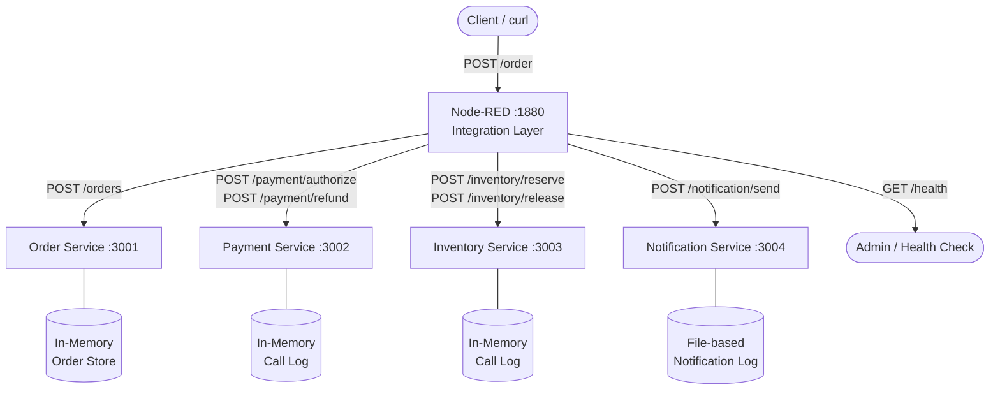
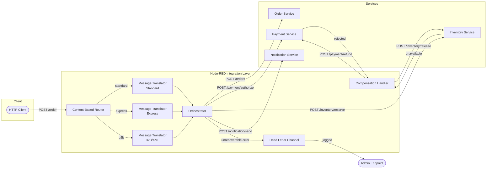
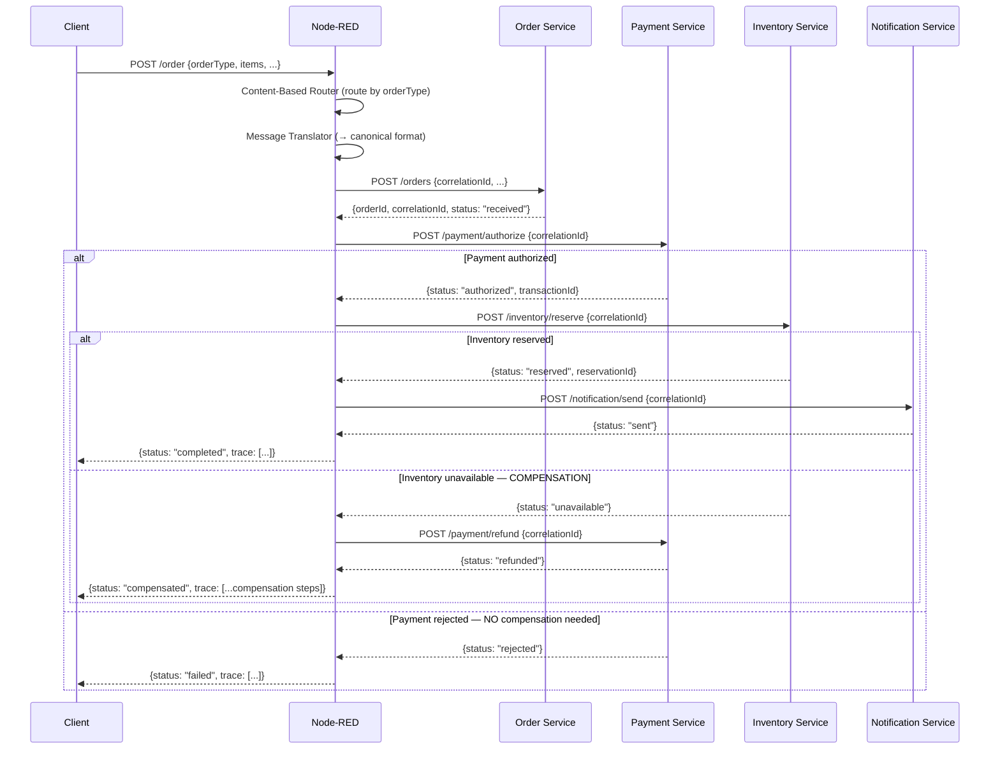

# EAI Capstone: Orchestrated Enterprise Application Integration System

## How to Run

### Prerequisites

- Docker Desktop installed and running
- Git

### Start the system

```bash
git clone <your-repo-url>
cd practice-04-capstone
cp .env.example .env
docker compose up -d --build
```

Wait ~25 seconds, then verify all services are running:

```bash
curl http://localhost:1880/health     # Node-RED
curl http://localhost:3001/health     # Order Service
curl http://localhost:3002/health     # Payment Service
curl http://localhost:3003/health     # Inventory Service
curl http://localhost:3004/health     # Notification Service
```

### Send a test order

```bash
curl -s -X POST http://localhost:1880/order \
  -H "Content-Type: application/json" \
  -d '{"orderType":"standard","customerId":"c1","items":[{"productId":"p1","quantity":1}],"totalAmount":50,"currency":"USD"}'
```

### Stop

```bash
docker compose down
```

## Architecture Decision — Entry Point

**Chosen approach: Option A — Node-RED is the entry point.**

The client sends all order requests directly to Node-RED (`POST /order`), which then calls the Order Service to create a record, followed by Payment, Inventory, and Notification services in sequence. This approach was chosen because it centralises all orchestration logic in the integration layer, keeping the business services simple and stateless. The Order Service is responsible only for persisting order records — it has no knowledge of the overall process flow. This separation of concerns makes it easier to modify the orchestration logic (e.g. add a new step) without touching any business service.

## System Context Diagram



## Integration Architecture Diagram



## Orchestration Flow (Success + Compensation)



## EIP Pattern Mapping Table

| Pattern                    | Problem It Solves                                                                                                          | Where Applied                                                                                                                                            | Why Chosen                                                                                              |
| -------------------------- | -------------------------------------------------------------------------------------------------------------------------- | -------------------------------------------------------------------------------------------------------------------------------------------------------- | ------------------------------------------------------------------------------------------------------- |
| **Content-Based Router**   | Different order formats (standard, express, B2B) arrive at the same endpoint and need different processing paths           | Node-RED: `Content-Based Router` node routes by `orderType` field to 3 different translator nodes                                                        | The system must handle 3 different client types without changing the entry point URL                    |
| **Message Translator**     | Each order format uses different field names and structures; services expect a canonical format                            | Node-RED: 3 translator nodes (`Translate: Standard`, `Translate: Express`, `Translate: B2B`) normalise each format into a unified canonical object       | Prevents business services from needing to understand multiple input formats                            |
| **Correlation Identifier** | Requests pass through 4 independent services; without a shared ID it is impossible to trace a single order across all logs | A `correlationId` UUID is generated once in the Order Service and carried in every request body and `X-Correlation-Id` header throughout the entire flow | Required for distributed tracing, log correlation, and grading verification                             |
| **Dead Letter Channel**    | Some failures are unrecoverable (e.g. compensation itself fails); these messages must not be silently dropped              | Node-RED: `Dead Letter Channel` node stores failed messages in global context and exposes them via `GET /trace/:orderId`                                 | Ensures no message is permanently lost without operator visibility; supports manual retry or inspection |

## Failure Analysis

### Scenario 1 — Payment Rejection

**Configuration:** `PAYMENT_FAIL_MODE=always`

**What fails:** Payment Service returns `{ status: "rejected" }` (HTTP 422)

**System reaction:**

- Node-RED receives the rejection
- Inventory Service is **not called** (no unnecessary reservation)
- Notification Service is **not called**
- No compensation is needed (nothing succeeded yet)

**Final state:**

```json
{
  "status": "failed",
  "reason": "Payment declined",
  "trace": [{ "step": "payment", "status": "failed", "durationMs": 27 }]
}
```

### Scenario 2 — Inventory Unavailable (Compensation triggered)

**Configuration:** `INVENTORY_FAIL_MODE=always`, `PAYMENT_FAIL_MODE=never`

**What fails:** Inventory Service returns `{ status: "unavailable" }` (HTTP 422) after payment already succeeded

**System reaction:**

- Payment was already authorized → must be reversed
- Node-RED calls `POST /payment/refund` (compensation step 1)
- Notification Service is **not called**

**Final state:**

```json
{
  "status": "compensated",
  "reason": "Insufficient stock",
  "trace": [
    { "step": "payment", "status": "success", "durationMs": 17 },
    { "step": "inventory", "status": "failed", "durationMs": 8 },
    { "step": "compensation:payment-refund", "status": "success" }
  ]
}
```

## AI Usage Disclosure

AI tools (Claude by Anthropic) were used during this project. Specifically:

- The `flows.json` orchestration logic was generated with AI assistance, including the Content-Based Router, Message Translator nodes, compensation flow, and Dead Letter Channel implementation.
- The `inventory-service/server.js` TODO sections were completed with AI assistance.
- The README structure, diagrams, and pattern descriptions were drafted with AI assistance.

I reviewed all generated code, ran each service manually, tested all three scenarios (happy path, payment failure, inventory failure with compensation), and verified the expected responses. I understand the overall architecture: Node-RED acts as the central orchestrator calling each service in sequence, carrying a correlationId throughout, and running compensation in reverse order when a step fails.
